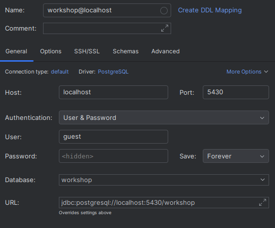

# Database Workshop

## Getting Started

### 1. Configure your local environment (optional)

Create a local file `.env.local` and override the necessary environment variables.

For example:

```.env.local
CONTAINER_NAME=local-db
PORT=5430
```

> [!IMPORTANT]
> Check details before start the container

<details>
    <summary><b>SUBNET Details</b> (important)</summary>

The container use a default subnet defined at .env file. It is recommended to verify the subnet range to avoid
conflicts with other docker networks or/and VPNs

Use the following command to validate the subnet range:

    ip l r

You also can check existing docker network using

    docker network list
    docker network inspect <network>

</details>

### 2. Set everything up

Use `make init` to start all containers.

The command also accepts [extra options](https://docs.docker.com/reference/cli/docker/compose/up/#options).

### 3. If you want to start/stop/remove your containers

Run `make up` to start your containers.</br>
Run `make stop` to stop your containers.</br>
Run `make down` to stop and remove your containers.</br>

### 4. Setup the database connection in your prefered IDE or database manager.

Use the variables defined in the environment files (`.env`, `.env.local`) to set up your database connexion.

**For example:**

Having the following variables defined:

<table>
<thead>
<th>.env</th>
<th>.env.local</th>
</thead>
<tbody>
<td>

```dotenv
DB_USER=guest
DB_PASSWORD=password
DB=workshop
PORT=5432
```

</td>
<td>

```dotenv
PORT=5430
```

</td>
</tbody>
</table>

The database connection can be established with `localhost` on the port `5430` due is overridden on `.env.local`.

